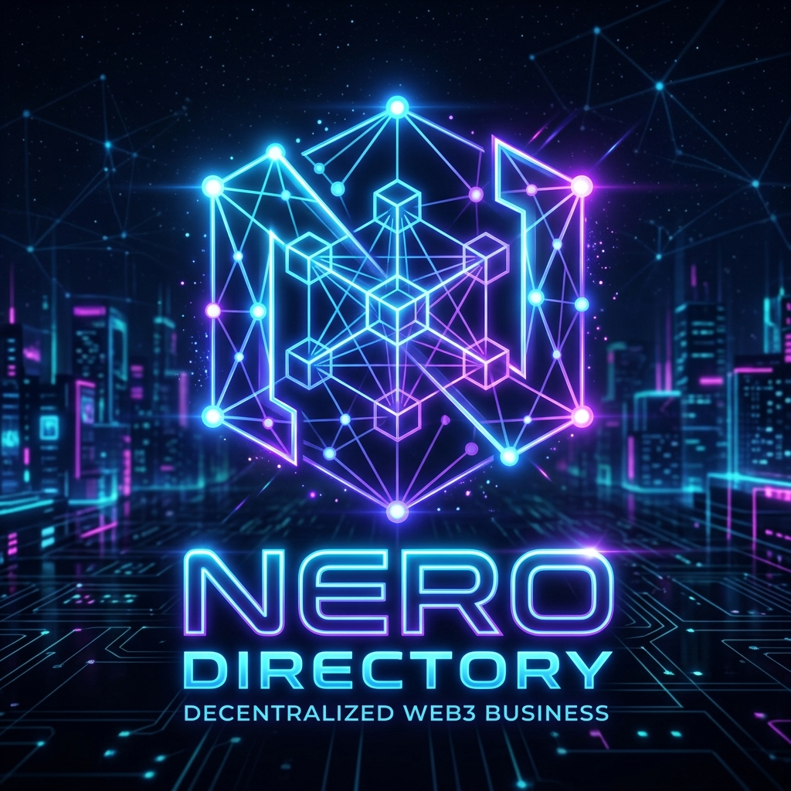
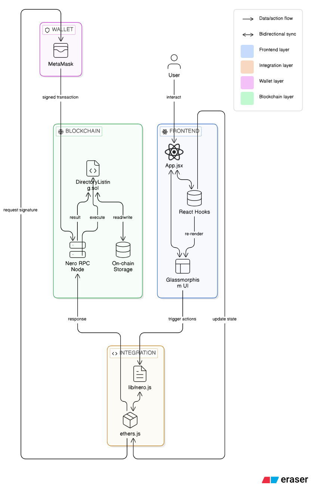

<div align="center">
  
  <h1>Nero Business Directory</h1>
  <p><strong>A Next-Generation Decentralized On-Chain Utility on NERO Chain</strong></p>
</div>

```
CONTRACT_ADDRESS = "give_your_own_contract_address_after_deployment"
NETWORK = "NERO Testnet (Chain ID: Give_your_chain_ID)"
```

# 👋 Welcome to the Nero Business Directory
🚀 Unleashing the power of Web3, this project leverages the **NERO Chain** to maintain a global, immutable directory of businesses. Originally conceptualized for Stellar, the platform has been successfully migrated to EVM and is built natively on decentralized principles to ensure full transparency and trustless peer-to-peer verification.

# 🧑‍💻 Tech Stack
- 🧑‍🎓 **Smart Contract Layer**: Deployed natively via **Solidity** to the **NERO Testnet** for immutable CRUD operations and network state modifications. Uses Hardhat for development.
- 🌱 **Integration Layer**: Utilizes `ethers.js` alongside MetaMask for secure wallet connection, signing, and executing transactions on the EVM network.
- 💬 **Architectural Flow**: Designed to act as a direct, trustless peer-to-peer verification hub.
- 🚀 **Next-Gen Frontend**: A fully custom React 19 visual interface powered by Vite to display blockchain data streams.

# 🌐 Decentralized Features

### **1. On-Chain Deployment**
Interacting directly with EVM smart contracts, users can deploy trustless profiles for newly verified businesses (Metadata, Location, Routing) and permanently anchor them onto the NERO ledger.

### **2. Peer Consensus & Ratings**
Leveraging decentralized peer verification parameters, any connected node/wallet can function as a *Rater*. Trust mechanics and verification status are embedded directly into the Solidity contract logic.

### **3. Seamless Wallet Integration**
Fully integrated with MetaMask to automatically detect the NERO network, request chain switching, or add the NERO Testnet to the user's wallet automatically if missing.

---

### 🏗️ System Architecture Flow



#### 1. Frontend Layer (React + Vite)
- **App Shell (`App.jsx`)**: The core entry point that maintains the application state. It manages connection details, loading states, and the current interactive view (`landing` vs `app`).
- **UI Components & Glassmorphism (`App.css`)**: Pure CSS styling utilizing `--mouse-x` and `--mouse-y` runtime properties to handle 3D hardware-accelerated transforms and interactive heat-glow lighting without heavy external animation libraries.
- **State Management**: Uses React hooks (`useState`, `useEffect`, `useRef`) for local state. Actions that interact with the blockchain trigger a loading sequence and handle promise resolutions cleanly to update the UI "Terminal".

#### 2. Integration Layer (`lib/nero.js`)
- Interfaces between the React frontend and the EVM Smart Contract on the NERO chain. 
- Handles MetaMask wallet authentication, connection, and automatic network switching (`checkConnection`, `connectWallet`, `addAndSwitchNeroNetwork`).
- Wraps all EVM smart contract network calls into asynchronous functions (`createListing`, `updateListing`, `verifyListing`, etc.) using `ethers.js`.

#### 3. Blockchain Layer (NERO Testnet / EVM)
- **Smart Contract (`DirectoryListing.sol`)**: Handles the CRUD operations and immutable storage for the business directory on the NERO EVM network.
- **State Changes**: Methods for listing creation, updating fields, rating modifications, and deactivations.
- **Verification**: Built-in mechanisms embedded in the contract state to keep listing data trustworthy.

---

# 🚀 Getting Started

### Prerequisites
- Node.js (matches `latest` stable build)
- [MetaMask](https://metamask.io/) Browser Extension
- Some testnet NERO from the [NERO Faucet](https://faucet.nerochain.io/)

### Initialization

1. **Clone the repository:**
   ```bash
   git clone https://github.com/pratyush06-aec/directorylisting_NERO.git
   cd directory_listing
   ```

2. **Install node dependencies:**
   ```bash
   npm install
   ```

3. **Ignite the Local Network:**
   ```bash
   npm run dev
   ```

To explore the dApp locally, boot up `http://localhost:5173`. Ensure your MetaMask extension is connected and switched to the **NERO Testnet**.

### Smart Contract Deployment (For Developers)

If you wish to deploy your own instance of the contract:
1. Navigate to the `evm-contracts` folder.
2. Run `npm install` inside that folder.
3. Update `hardhat.config.js` with your Private Key.
4. Run the deployment script:
   ```bash
   npx hardhat run scripts/deploy.js --network neroTestnet
   ```
5. Take the resulting contract address and update the `CONTRACT_ADDRESS` constant in `lib/nero.js`.

---
<p align="center">
  <b>⭐ If you liked the project, please don't forget to give a star</b>
</p>
